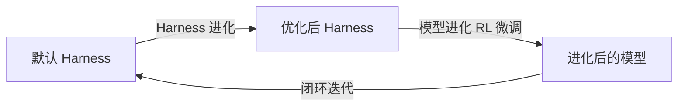

> **决定 Agent 性能的是 Harness（行为管线），而不仅仅是模型。**  
> 相同的基础模型，因上下文管理、工具编排、错误恢复和评估信号反馈不同，产生截然不同的结果。

**HarnessX** 由 [Darwin Agent Team](https://github.com/Darwin-Agent) 开发，定位为 **Agent Harness 铸造厂**。核心理念：**组合 Harness，定义 Agent** —— 从零代码到完全定制，一个核心，X 个入口。

- **开源协议**：MIT License
- **语言版本**：Python 3.11+ | v0.1.0 Beta
- **仓库地址**：[github.com/Darwin-Agent/HarnessX](https://github.com/Darwin-Agent/HarnessX)

---

## 🔭 核心设计理念

大多数框架只解决了**模型替换**问题，但**行为替换**成本极高——从编程 Agent 切换到研究 Agent、添加记忆或护栏，意味着重写整个 Agent。

HarnessX 通过一个干净的分离解决：

```python
agent = model.agentic(harness)
```

| 层 | 职责 | 示例 |
|----|------|------|
| **ModelConfig** | 提供商路由、降级回退、按角色分配模型 | `AnthropicProvider("claude-sonnet-4-6")` |
| **HarnessConfig** | 完整行为管线（工具、记忆、处理器、追踪、沙箱） | 9 维度可组合配置 |

"**X**" = e**X**tensible Behavior Composition（可扩展行为组合），三大核心能力：

- 🧩 **组合（Compose）** — 9 维度行为管线；任何行为 = Processor，通过 `|` 操作符组合
- ⚙️ **适配（Adapt）** — Harness 观察性能并自动搜索最优配置
- 🚀 **进化（Evolve）** — 每次运行产生带奖励标注的轨迹，用于 SFT/RL 训练

---

## 🏗️ 架构：9 维度行为管线

HarnessX 将 Agent 行为组织为 **9 个正交维度**，映射到三大支柱：

| 维度 | 名称 | 控制内容 | 所属支柱 |
|:---:|------|----------|:---:|
| 1 | **模型选择** | 多提供商路由 + 角色分配（main / judge / evaluator） | 🧩 Compose |
| 2 | **上下文组装** | 系统提示策略 + 历史截断 + 用户消息包装 | 🧩 Compose |
| 3 | **记忆管理** | 提取→存储→检索，5 种可插拔策略（含自研 Light-Memory） | 🧩 Compose |
| 4 | **工具生态** | 内置工具 + MCP 协议 + Skills + 过滤器 | 🧩 Compose |
| 5 | **执行环境** | 沙箱隔离：Local / Docker / E2B 云沙箱 | 🧩 Compose |
| 6 | **评估与奖励** | LLM Judge / SelfVerify / PRM / 基准评估器 | ⚙️ Adapt |
| 7 | **控制与安全** | 13 个处理器：循环检测、成本守卫、压缩、谄媚检查等 | ⚙️ Adapt |
| 8 | **可观测性** | HarnessJournal (JSONL) + OpenTelemetry + 检查点 + 会话恢复 | 🚀 Evolve |
| 9 | **训练桥接** | 轨迹 → SFT/RL 记录，含 token 级标注 | 🚀 Evolve |

### 事件驱动的处理器管道

所有行为以 **Processor** 形式实现，注册到 8 个钩子点，通过 `|` 组合，有穷尽的冲突检测：

```python
from harnessx.bundles.coding import make_coding
from harnessx.bundles.reliability import make_reliability

config = (make_coding(working_dir=".") | make_reliability()).build()
# 若 singleton_group 冲突 → HarnessConflictError，不允许静默覆盖
```

---

## 🧩 处理器系统（7 大类）

所有行为通过可组合的处理器实现，以下是 7 大类别和典型处理器：

### 1. 上下文（Context）— `processors/context/`

控制系统提示组装、对话历史管理和用户消息包装策略。

| 处理器 | 功能 |
|--------|------|
| SystemPromptStrategy | 注入不同的系统提示模板 |
| HistoryTruncation | 滑动窗口 / 摘要截断历史对话 |
| UserMessageWrapper | 包装用户输入（如添加时间戳、上下文标签） |

### 2. 控制（Control）— `processors/control/`

**13 个安全与可靠性处理器**，确保 Agent 行为可控：

| 处理器 | 功能 |
|--------|------|
| LoopDetector | 检测 Agent 陷入循环 |
| CostGuard | 预算/费用上限保护 |
| CompactionTrigger | 上下文接近限制时自动压缩 |
| SycophancyCheck | 检测并防止谄媚行为 |
| StopGuard | 剥离过早出现的终止标记 |
| ToolCallValidator | 验证工具调用参数合法性 |
| RateLimiter | 控制工具调用频率 |
| ContentFilter | 过滤不安全输出内容 |

### 3. 评估（Evaluation）— `processors/evaluation/`

| 处理器 | 功能 |
|--------|------|
| LLMJudge | 使用独立模型评判输出质量 |
| SelfVerify | Agent 自我验证答案 |
| PRM (Process Reward Model) | 过程奖励模型，分步评分 |
| BenchmarkEvaluator | 对接标准基准测试评估 |

### 4. 记忆（Memory）— `processors/memory/`

**5 种可插拔策略**，支持提取、存储、检索全链路：

| 策略 | 说明 |
|------|------|
| Light-Memory | 自研文件记忆（见下节详述） |
| Vector Memory | 向量数据库记忆后端 |
| Summary Memory | 摘要式压缩记忆 |
| Sliding Window | 滑动窗口保留最近 N 轮 |
| Hybrid | 组合多种策略 |

### 5. 多模型（Multi-Model）— `processors/multi_model/`

| 处理器 | 功能 |
|--------|------|
| ModelRouter | 根据任务类型路由到不同模型 |
| FallbackChain | 主模型失败时自动降级 |
| EnsembleVoter | 多模型投票/集成决策 |

### 6. 可观测性（Observability）— `processors/observability/`

| 处理器 | 功能 |
|--------|------|
| HarnessJournal | JSONL 格式轨迹日志 |
| OpenTelemetry | 标准 OTel 追踪导出 |
| Checkpoint | 运行状态检查点，支持恢复 |
| MetricsCollector | 延迟、成功率、token 消耗等指标 |

### 7. 工具（Tools）— `processors/tools/`

| 处理器 | 功能 |
|--------|------|
| SkillLoader | 动态加载技能模块 |
| SchemaAdapter | 工具 Schema 适配/转换 |
| ToolFilter | 按条件过滤可用工具列表 |
| MCPConnector | MCP 协议工具连接 |

---

## 🧠 Light-Memory（自研记忆系统）

> 位于 `harnessx/plugins/dimensions/light_memory/`  
> 零外部依赖，纯 Python stdlib + 文件系统实现

### 设计理念

为个人助手场景设计：单个 Agent 长期积累和回忆知识，**无需外部向量数据库**。

### 工作流程

```
任务 Prompt
    │
    ▼
[关键词提取 + 实体增强]
    │
    ▼
[Grep 记忆文件 → 匹配分数]
    │
    ▼
[指数时间衰减排序]          ← score = importance × e^(−λ × days_since_access)
    │
    ▼
[Top-K 候选表 → 系统提示]
    │
    ▼
Agent 使用内置工具（Read/Write/Edit）读写记忆文件
    │
    ▼
[每日压缩] + [后台整理] + [Git 提交]
```

### 核心机制

| 机制 | 说明 |
|------|------|
| **文件存储** | 每条记忆 = Markdown 文件 + YAML frontmatter，无外部 DB |
| **记忆类型** | `style` / `profile` / `session` / `skill` / `learning` / `entity` / `daily` |
| **指数衰减** | `importance × exp(−ln2 × days / half_life)` — 久未访问的记忆自然淡出 |
| **每日压缩** | 会话结束时将对话轮次压缩为结构化日志 |
| **后台整理** | 后台协程定期合并和去重记忆文件 |
| **Git 版本控制** | 可选集成 — 每次写记忆自动 commit |
| **Agent 驱动召回** | Agent 直接用自身工具读取记忆，非黑盒检索 |

### 使用示例

```python
from harnessx.plugins.dimensions.light_memory import LightMemoryPlugin

plugin = LightMemoryPlugin(
    memory_root="~/.harnessx/memory",
    half_life_days=30,      # 记忆淡出速度
    top_k=15,               # 每轮最多注入候选数
    auto_recall=True,       # 任务开始自动注入召回候选
    auto_capture=False,     # 让 Agent 自己决定何时写入记忆
    auto_commit=True,       # 每次写记忆自动 git commit
)

builder = HarnessBuilder().plugin(plugin)
```

---

## 🔌 模型提供商

HarnessX 支持 6 个模型后端，通过统一的 `agentic` mixin 接入：

```python
from harnessx.core.model_config import ModelConfig
from harnessx.providers.anthropic_provider import AnthropicProvider

model = ModelConfig(main=AnthropicProvider("claude-sonnet-4-6"))
```

| 提供商 | 模型示例 |
|--------|----------|
| Anthropic | Claude Opus 4.6 / Sonnet 4.5 / Haiku 4.5 |
| OpenAI | GPT-5 / GPT-4o |
| Google | Gemini 系列 |
| DeepSeek | DeepSeek 系列 |
| Qwen | Qwen 3.5 系列 |
| 本地模型 | 兼容 OpenAI API 的本地部署 |

### 角色分配

`ModelConfig` 支持按角色分配不同模型：

```python
model = ModelConfig(
    main=AnthropicProvider("claude-sonnet-4-6"),     # 主执行模型
    judge=AnthropicProvider("claude-haiku-4-5"),     # 评估模型（省钱）
    evaluator=OpenAIProvider("gpt-4o"),              # 基准评估器
)
```

---

## 📊 基准测试与进化

HarnessX 提供两个进化循环，可在任意基准上系统性提升 Agent 性能：

### 进化双循环



1. **Harness 进化** — 元 Harness 分析轨迹，自动搜索更优的处理器组合、提示策略和工具配置，**不改变模型**
2. **模型进化** — 带奖励标注的轨迹通过 [VERL](https://github.com/volcengine/verl) 进行 RL 微调

### 关键实验结果

**Harness 进化（Qwen 3.5 9B）：**
- 默认 Harness (R0)：33%
- 元 Harness 逐轮发现更优配置
- R3 达到 **47%**（零模型改动，+14pp）

**Harness 进化（GPT-5）：**
- 基线：62%
- 进化后：**84%**（+22pp，五个领域全面提升）

**模型-Harness 协同进化（Qwen 3.5 9B）：**

| 阶段 | 分数 | 提升 |
|------|------|------|
| 基线 | 33.97% | — |
| Harness 进化 | 41.67% | +7.7pp |
| 模型进化（RL） | **55.77%** | +14.1pp |
| **总体** | — | **+64% 相对提升** |

全部在 9B 模型上实现，证明**小模型 + 好 Harness > 大模型 + 默认配置**。

### 已集成基准测试

| 基准 | 说明 | 状态 |
|------|------|:---:|
| [Terminal Bench 2.0](https://github.com/harbor-framework/terminal-bench-2) | 89 个 bash/文件系统任务 | ✅ |
| [GAIA](https://huggingface.co/datasets/gaia-benchmark/GAIA) | 通用 Agent 推理+工具使用 | ✅ |
| [SWE-bench](https://www.swebench.com) | 真实 GitHub Issue 修复 | ✅ |
| [TAU2-Bench](https://github.com/sierra-research/tau2-bench) | 工具增强+用户模拟 | ✅ |
| LoCoMo | 长上下文记忆评估 | 🔄 |
| EvoClAW | 进化式 Agent 基准 | 🔄 |
| OSWorld | 操作系统级 Agent 任务 | 🔄 |

### Terminal Bench 2.0 对比结果

| Agent | 模型 | 分数 |
|-------|------|:---:|
| **HarnessX** | claude-opus-4-6 | **63.0%** |
| Claude Code | claude-opus-4-6 | 58.0% ± 2.9 |
| **HarnessX** | claude-haiku-4-5 | **31.5%** |
| Claude Code 2.0.31 | claude-haiku-4-5 | 27.5% ± 2.8 |

> 同一模型下 HarnessX 在 Terminal Bench 上全面优于 Claude Code。

---

## 🚀 CLI 与 SDK

### 安装

**一键安装（交互式）：**

```bash
curl -sSf https://raw.githubusercontent.com/Darwin-Agent/HarnessX/main/scripts/install.sh | bash
```

**非交互式（全组件）：**

```bash
curl -sSf https://raw.githubusercontent.com/Darwin-Agent/HarnessX/main/scripts/install.sh | bash -s -- --all
```

**手动安装（uv）：**

```bash
uv python install 3.12
uv venv --python 3.12 .venv
source .venv/bin/activate
uv pip install -e .
cd frontend && npm install && npm run build && cd ..
```

### CLI 命令

```bash
export ANTHROPIC_API_KEY=sk-...

# 交互模式下执行任务
hx "研究 2026 年 AI Agent 趋势并撰写结构化报告"

# 非交互模式，输出后退出
hx -p "用 Python 写一个 fizzbuzz"

# 加载 YAML 配置文件
hx -c path/to/config.yaml

# 恢复之前的会话
hx --resume <run_id>

# 打开 Lab UI（localhost:8000）
hx lab
```

### Python SDK

```python
import asyncio
from harnessx import BaseTask, HarnessConfig
from harnessx.core.model_config import ModelConfig
from harnessx.providers.anthropic_provider import AnthropicProvider

async def main():
    model = ModelConfig(main=AnthropicProvider("claude-sonnet-4-6"))
    harness = model.agentic(HarnessConfig())
    result = await harness.run(BaseTask(description="What is 2 + 2?"))
    print(result.final_output)

asyncio.run(main())
```

---

## 🌐 IM Gateway

通过单一服务将 Agent 连接到主流 IM 平台，内置 React 管理控制台：

```bash
hx-gateway start   # 配置文件：~/.harnessx/gateway.yaml
```

| 平台 | 支持 |
|------|:---:|
| 飞书 | ✅ |
| Telegram | ✅ |
| Slack | ✅ |
| Discord | ✅ |
| 钉钉 | ✅ |

---

## 📦 项目结构总览

```
HarnessX/
├── harnessx/                  # 🧠 核心框架
│   ├── core/                  #    Harness, Builder, RunLoop, State, Events, Trajectory
│   ├── processors/            #    7 大类 × 多个处理器
│   │   ├── context/           #    📝 系统提示、历史、用户包装
│   │   ├── control/           #    🛡️ 13 个安全与可靠性处理器
│   │   ├── evaluation/        #    📊 LLM 裁判、PRM、自验证
│   │   ├── memory/            #    🧠 提取、检索、5 种策略
│   │   ├── multi_model/       #    🔗 模型路由
│   │   ├── observability/     #    🔭 OTel、检查点、指标
│   │   └── tools/             #    🔧 技能加载器、Schema 适配器、过滤器
│   ├── providers/             # 🔌 6 个模型后端 + agentic mixin
│   ├── plugins/               # 🧩 插件基类、发现机制、内置插件
│   ├── tools/                 # ⚒️ 工具注册表、内置工具
│   ├── sandbox/               # 📦 本地、Docker、E2B
│   ├── tracing/               # 📡 Journal、OTel、空追踪器
│   ├── rl/                    # 🧬 RLConfigSpec、TaskBuilder
│   ├── bundles/               # 📦 预组合能力 Bundle
│   ├── api/                   # 🌐 FastAPI + SSE（Lab UI 后端）
│   └── cli.py                 # ⌨️ CLI 入口 (hx)
├── benchmarks/                # 📊 7 个基准测试适配器
├── recipe/                    # 🧪 RL 训练配方（slime、gaia_evolver、verl_harnessX）
├── examples/                  # 📖 coding / research / assistant / custom_processor
├── extensions/                # 🔌 技能扩展（docx, pdf, pptx, xlsx）
├── frontend/                  # 🖥️ Lab UI（React + TypeScript + Tailwind）
├── gateway/                   # 🌐 IM 网关
├── tests/                     # ✅ 单元、集成、E2E 测试
└── docs/                      # 📄 架构文档
```

---

## 🛤️ 关键设计决策

### 1. Model ⇄ Harness 分离

不同于 LangChain/LlamaIndex 将模型和行为耦合，HarnessX 通过 `model.agentic(harness)` 实现关注点分离，使得：
- 同一 Harness 可用于不同模型（A/B 测试）
- 同一模型可搭配不同 Harness（行为切换零成本）

### 2. Processor 管道 + 冲突检测

使用 `|` 操作符组合处理器，运行前静态分析冲突（如两个处理器占据同一 singleton_group），抛出 `HarnessConflictError`，防止静默覆盖导致的行为异常。

### 3. Bundle 预组合模式

通过 `bundles/` 目录提供预组合的能力包，开箱即用：
- `make_coding(working_dir=".")` — 编程 Agent
- `make_reliability()` — 可靠性增强
- `make_research()` — 研究 Agent

### 4. 元 Harness + 贝叶斯优化

Harness 进化使用元 Harness 观察 Agent 轨迹，在约 10^6 的配置空间中自动搜索最优组合，不依赖人工调参。

---

## 🗺️ 路线图

| 阶段 | 重点 | 状态 |
|:---:|------|:---:|
| **Phase 1** | 核心：9 维行为管线、13 个处理器、多提供商、SFT/RL 桥接、Lab UI | ✅ 当前 |
| **Phase 2** | 元优化：贝叶斯优化、Meta-Harness、自动配置搜索 | 🔄 进行中 |
| **Phase 3** | 自进化：闭环训练、HarnessHUB 社区市场 | 📋 计划中 |
| **Phase 4** | 记忆：多模态后端、第三方集成（VERL, SuperMemory, OpenVKing） | 📋 计划中 |

### 仓库内已实现

- [x] **Light-Memory** — 文件记忆 + 时间衰减 + 每日压缩 + Git 版本控制
- [x] **Slime RL 配方** — SGLang rollout + token 标注 + GRPO 训练管线
- [x] **MetaHarness** — 观察自身轨迹 → 提议 Harness 配置变更
- [ ] **LoCoMo 基准** — 长上下文记忆评估
- [ ] **贝叶斯优化** — ~10^6 配置空间搜索
- [ ] **HarnessHUB** — 社区市场：`hx pull coding-agent@v1.2`
- [ ] **多模态记忆** — CLIP 图像/视频记忆后端
- [ ] **Harness 记忆进化** — 闭环：轨迹 → RL → 更好模型 → 更好 Harness

### 第三方集成

- [x] **[VERL](https://github.com/volcengine/verl)** — 分布式 PPO/GRPO 训练
- [ ] **[MemPalace](https://github.com/mem-palace/mem-palace)** — 结构化情节记忆
- [ ] **[SuperMemory](https://supermemory.ai)** — 云端语义记忆
- [ ] **[OpenVKing](https://github.com/openvking)** — 向量知识图谱记忆

---

## 💡 与其他框架的对比

| 维度 | HarnessX | LangChain | CrewAI | AutoGen |
|------|:---:|:---:|:---:|:---:|
| **模型-行为分离** | ✅ 原生设计 | ❌ 耦合 | ❌ 耦合 | 部分 |
| **行为可组合** | ✅ `\|` 操作符 + 冲突检测 | 部分链式 | 固定角色 | 固定角色 |
| **自进化能力** | ✅ 双循环进化 | ❌ | ❌ | ❌ |
| **记忆系统** | ✅ 自研 Light-Memory（零依赖） | 外部向量库 | 简易 | 外部 |
| **IM 网关** | ✅ 飞书/Telegram/Slack/Discord/钉钉 | ❌ | ❌ | ❌ |
| **沙箱隔离** | ✅ Local/Docker/E2B | ❌ | ❌ | Docker |
| **RL 训练桥接** | ✅ VERL/SGLang/GRPO | ❌ | ❌ | ❌ |
| **学习曲线** | 中等 | 陡峭 | 简单 | 中等 |

---

## 📝 引用

```bibtex
@software{harnessx2026,
  title   = {HarnessX: A Composable, Self-Evolving Agent Harness Foundry},
  author  = {Darwin Agent Team},
  year    = {2026},
  url     = {https://github.com/Darwin-Agent/HarnessX},
  license = {MIT},
}
```

---

<div align="center">
  <strong>HARNESSX</strong> — <em>组合。适配。进化。</em>
  <br/>
  <sub>由 <strong>Darwin Agent Team</strong> 精心打造 · 文档由 superSelfJa 整理</sub>
</div>
